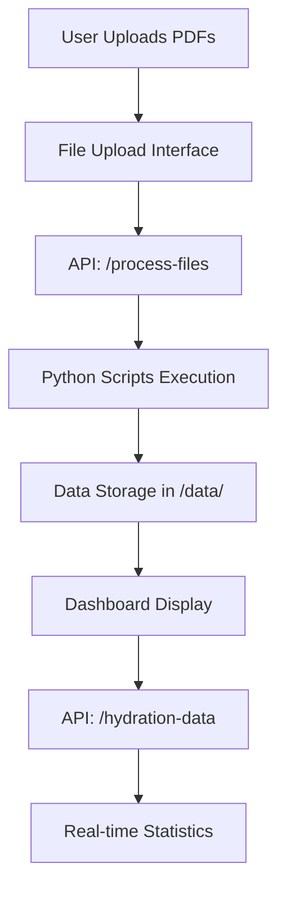
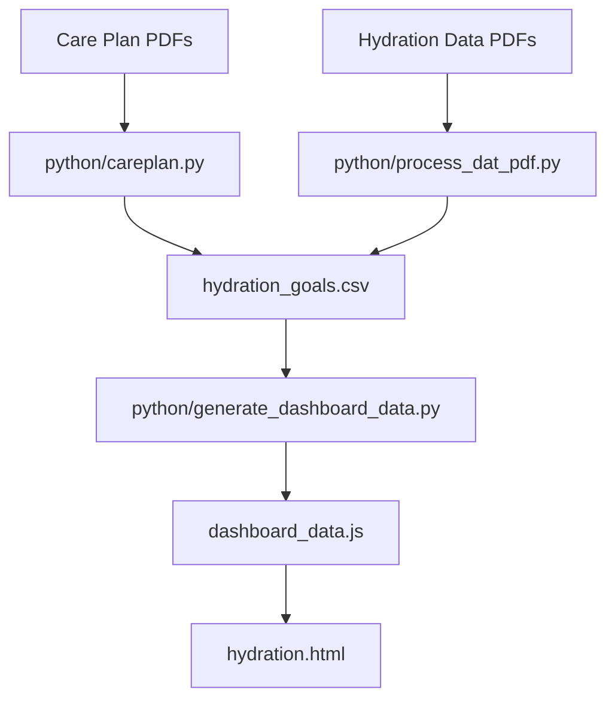

# Hydration Dashboard System

A comprehensive system for processing care plan PDFs and hydration data to generate a modern web dashboard showing resident hydration goals and daily consumption. The system includes both a traditional Python-based processing pipeline and a modern Next.js web application with Firebase authentication.

## 🏗️ System Architecture

The system consists of two main components:

### 1. **Python Processing Pipeline** (Traditional)
- Processes PDF files to extract resident data
- Generates CSV files and JavaScript data
- Creates static HTML dashboard

### 2. **Modern Web Application** (Next.js + Firebase)
- Multi-user authentication system
- Role-based access control (Admin vs Home Manager)
- File upload interface with automated processing
- Real-time dashboard with statistics

## 🚀 Quick Start

### Option A: Modern Web Application (Recommended)

```bash
# 1. Navigate to the project directory
cd hydration

# 2. Install dependencies
npm install

# 3. Install Python dependencies
pip install PyPDF2 pdfminer.six

# 4. Set up Firebase (see Firebase Setup section)

# 5. Run the application
npm run dev
```

Visit [http://localhost:3000](http://localhost:3000) to access the web application.

### Option B: Traditional Python Pipeline

```bash
# 1. Process care plan PDFs
python3 python/careplan.py

# 2. Process hydration data PDFs
python3 python/process_dat_pdf.py

# 3. Generate dashboard data
python3 python/generate_dashboard_data.py

# 4. Open the dashboard
open hydration.html
```

## 📋 Prerequisites

- **Node.js 18+** (for web application)
- **Python 3.6+** (for PDF processing)
- **Firebase project** (for web application authentication)
- **PDF processing libraries**: `PyPDF2`, `pdfminer.six`

## 🔧 Installation

### Python Dependencies
```bash
pip install PyPDF2 pdfminer.six
```

### Node.js Dependencies (for web app)
```bash
npm install
```

## 🔥 Firebase Setup

1. **Create Firebase Project**
   - Go to [Firebase Console](https://console.firebase.google.com)
   - Create a new project

2. **Enable Authentication**
   - Go to Authentication → Sign-in method
   - Enable Email/Password provider

3. **Enable Firestore Database**
   - Go to Firestore Database
   - Create database in production mode
   - Set up security rules (see Security section)

4. **Get Configuration**
   - Go to Project Settings → General
   - Add a web app and copy the config

5. **Environment Variables**
   Create `.env.local` in the project root:
   ```env
   NEXT_PUBLIC_FIREBASE_API_KEY=your_api_key_here
   NEXT_PUBLIC_FIREBASE_AUTH_DOMAIN=your_project_id.firebaseapp.com
   NEXT_PUBLIC_FIREBASE_PROJECT_ID=your_project_id
   NEXT_PUBLIC_FIREBASE_STORAGE_BUCKET=your_project_id.appspot.com
   NEXT_PUBLIC_FIREBASE_MESSAGING_SENDER_ID=your_sender_id
   NEXT_PUBLIC_FIREBASE_APP_ID=your_app_id
   ```

## 🎯 User Roles & Access

### **Admin Users**
- Can upload files for any retirement home
- Can create and manage other users
- Can view all data across all homes
- Access to: File Upload, User Management

### **Home Manager Users**
- Can only view data for their specific retirement home
- Can delete all data for their home
- Access to: Hydration Data, Delete All Data

## 📁 Directory Structure

```
hydration/
├── care-plans/                    # Care plan PDFs (names & goals)
│   ├── 1.pdf, 2.pdf, 3.pdf, etc.
├── hydration-data/               # Daily consumption PDFs
│   ├── CG.pdf, HH.pdf, MG.pdf
│   └── *-Extra.pdf files
├── src/                         # Next.js application
│   ├── app/                     # Next.js app directory
│   │   ├── api/                 # API routes
│   │   │   ├── process-files/route.ts
│   │   │   ├── hydration-data/route.ts
│   │   │   ├── create-user/route.ts
│   │   │   └── delete-home-data/route.ts
│   │   ├── page.tsx             # Home page
│   │   └── layout.tsx           # Root layout
│   ├── components/              # React components
│   │   ├── Dashboard.tsx        # Main dashboard
│   │   ├── FileUpload.tsx       # File upload interface
│   │   ├── HydrationData.tsx    # Data display
│   │   ├── LoginForm.tsx        # Authentication
│   │   └── UserManagement.tsx   # User management
│   └── lib/
│       └── firebase.ts          # Firebase configuration
├── python/                      # Python scripts
│   ├── careplan.py              # Extract names & goals
│   ├── process_dat_pdf.py       # Process consumption data
│   └── generate_dashboard_data.py # Generate JS data
├── data/                        # User-specific data storage
└── .env.local                   # Environment variables
├── hydration_goals.csv         # Master data file
├── dashboard_data.js           # JavaScript data
└── hydration.html              # Traditional dashboard
```

## 🔄 Data Processing Pipeline

### Modern Web Application Flow



### Traditional Python Pipeline



## 🐍 Python Scripts

### 1. `careplan.py` - Care Plan Processor

**Purpose**: Extracts resident names and hydration goals from care plan PDFs with strict filtering.

**Key Features**:
- **Strict Name Extraction**: Uses regex pattern `"LASTNAME, FIRSTNAME (ID)"` with 4+ digit ID
- **Medical Condition Filtering**: Comprehensive list of medical conditions, symptoms, and medications to avoid false positives
- **Multi-page Processing**: Handles PDFs with multiple pages and residents
- **Debug Logging**: Extensive logging for troubleshooting

**Usage**:
```bash
python3 python/careplan.py
```

**Output**: Creates `hydration_goals.csv` with resident names in "LASTNAME, FIRSTNAME" format

### 2. `process_dat_pdf.py` - Hydration Data Processor

**Purpose**: Processes daily hydration consumption data and updates the CSV.

**Key Features**:
- **Automatic File Separation**: Handles regular and "Extra" files automatically
- **Fuzzy Name Matching**: Matches residents using flexible name matching
- **Daily Consumption Tracking**: Extracts Day 14, 15, 16, and Yesterday values
- **Missed 3 Days Calculation**: Determines if residents missed 3 consecutive days

**Usage**:
```bash
python3 python/process_dat_pdf.py
```

### 3. `generate_dashboard_data.py` - Dashboard Data Generator

**Purpose**: Converts CSV data to JavaScript format for dashboard display.

**Key Features**:
- **Statistics Calculation**: Goal met percentage, missed days count
- **JavaScript Generation**: Creates `dashboard_data.js` with resident objects
- **Summary Data**: Total residents, goal met counts, percentages

**Usage**:
```bash
python3 python/generate_dashboard_data.py
```

## 🌐 Web Application Features

### Authentication System
- **Firebase Authentication**: Secure email/password login
- **Role-based Access**: Admin vs Home Manager permissions
- **User Management**: Admins can create and manage users
- **Data Isolation**: Home managers only see their home's data

### File Upload System
- **Multiple File Support**: Upload multiple care plan and hydration data PDFs
- **Retirement Home Selection**: Associate files with specific homes
- **Automated Processing**: Python scripts run automatically after upload
- **Progress Tracking**: Real-time feedback during processing

### Dashboard Features
- **Real-time Statistics**: Total residents, goal met percentage, missed days
- **Resident Table**: Detailed view of all residents with consumption data
- **Data Management**: Delete all data for specific retirement home
- **Responsive Design**: Works on desktop and mobile devices

## 🔒 Security & Data Management

### Firebase Security Rules
```javascript
rules_version = '2';
service cloud.firestore {
  match /databases/{database}/documents {
    match /users/{userId} {
      allow read, write: if request.auth != null && request.auth.uid == userId;
    }
  }
}
```

### Data Isolation
- **Home-specific Data**: Each retirement home's data is stored separately
- **User Permissions**: Home managers can only access their home's data
- **Admin Override**: Admins can access all data for management purposes

### File Security
- **PDF Validation**: Only PDF files are accepted for upload
- **Path Sanitization**: File paths are sanitized to prevent directory traversal
- **User-specific Storage**: Files are stored in user-specific directories

## 🚀 Deployment

### Vercel (Recommended)
1. Push code to GitHub
2. Connect repository to Vercel
3. Add environment variables in Vercel dashboard
4. Deploy automatically

### Other Platforms
- **Netlify**: Static site hosting
- **AWS Amplify**: Full-stack deployment
- **Railway**: Simple deployment with environment variables
- **DigitalOcean App Platform**: Container-based deployment

## 🐛 Debugging & Troubleshooting

### Debug Logging
The system includes comprehensive debug logging:

1. **Frontend Logs**: Check browser console for React component logs
2. **API Logs**: Check terminal where Next.js is running for API route logs
3. **Python Scripts**: Debug output shows name extraction and filtering process

### Common Issues

**1. Firebase Authentication Errors**
```bash
# Check environment variables
cat .env.local

# Verify Firebase project configuration
# Ensure Authentication is enabled in Firebase Console
```

**2. File Processing Failures**
```bash
# Check Python dependencies
pip list | grep -E "(PyPDF2|pdfminer)"

# Verify file permissions
ls -la data/
```

**3. Build Errors**
```bash
# Clear Next.js cache
rm -rf .next

# Reinstall dependencies
npm install
```

**4. Name Extraction Issues**
- Check debug output in terminal when running `python/careplan.py`
- Verify PDF text extraction is working
- Review filtered names in debug logs

## 📊 Data Format

### CSV Structure (`hydration_goals.csv`)
```csv
Resident Name,mL Goal,Source File,Missed 3 Days,Day 14,Day 15,Day 16,Yesterday
"Smith, John",1500,1.pdf - Page 5,no,1200,1300,1400,1350
"Johnson, Mary",2000,2.pdf - Page 10,yes,800,900,850,900
```

### JavaScript Data Structure (`dashboard_data.js`)
```javascript
const hydrationData = [
  {
    "name": "Smith, John",
    "goal": 1500.0,
    "source": "1.pdf - Page 5",
    "missed3Days": "no",
    "day14": 1200.0,
    "day15": 1300.0,
    "day16": 1400.0,
    "yesterday": 1350.0
  }
];
```

## 🔧 Configuration

### Environment Variables
```env
# Firebase Configuration
NEXT_PUBLIC_FIREBASE_API_KEY=your_api_key
NEXT_PUBLIC_FIREBASE_AUTH_DOMAIN=your_domain
NEXT_PUBLIC_FIREBASE_PROJECT_ID=your_project_id
NEXT_PUBLIC_FIREBASE_STORAGE_BUCKET=your_bucket
NEXT_PUBLIC_FIREBASE_MESSAGING_SENDER_ID=your_sender_id
NEXT_PUBLIC_FIREBASE_APP_ID=your_app_id
```

### Python Configuration
- **PDF Libraries**: PyPDF2 (primary), pdfminer.six (fallback)
- **Name Extraction**: Strict regex pattern with medical condition filtering
- **File Processing**: Automatic detection of regular vs extra files

## 📈 Statistics & Analytics

The system automatically calculates:
- **Total Residents**: Count of unique residents across all homes
- **Goal Met Percentage**: Percentage of residents meeting daily hydration goals
- **Missed 3 Days**: Count of residents who missed 3 consecutive days
- **Daily Averages**: Average consumption across different time periods
- **Home-specific Metrics**: Statistics for individual retirement homes

## 🤝 Contributing

1. Fork the repository
2. Create a feature branch: `git checkout -b feature/new-feature`
3. Make your changes
4. Test thoroughly with different PDF formats
5. Submit a pull request with detailed description

## 📄 License

This project is licensed under the ISC License.

## 🆘 Support

For issues and questions:
1. Check the troubleshooting section above
2. Review debug logs for specific error messages
3. Verify all dependencies are installed correctly
4. Ensure Firebase configuration is complete

---

**Last Updated**: October 2024  
**Version**: 2.0 (Modern Web Application + Traditional Pipeline)