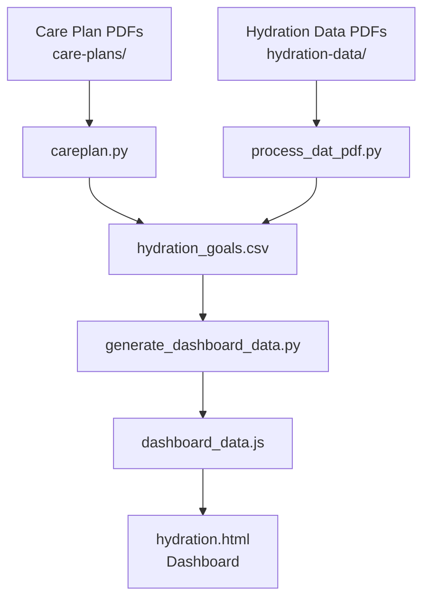
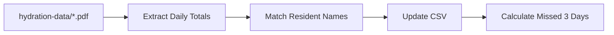
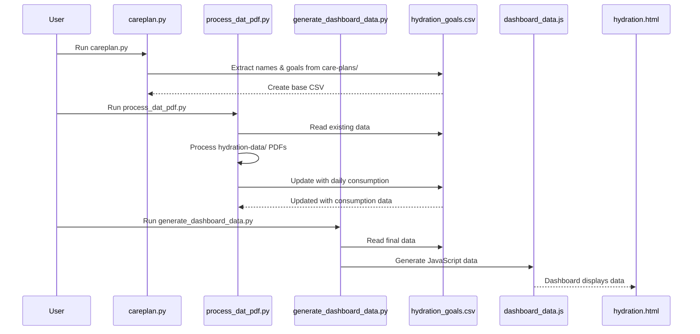
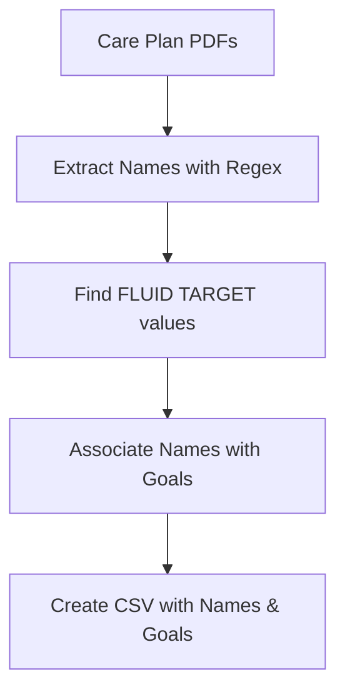
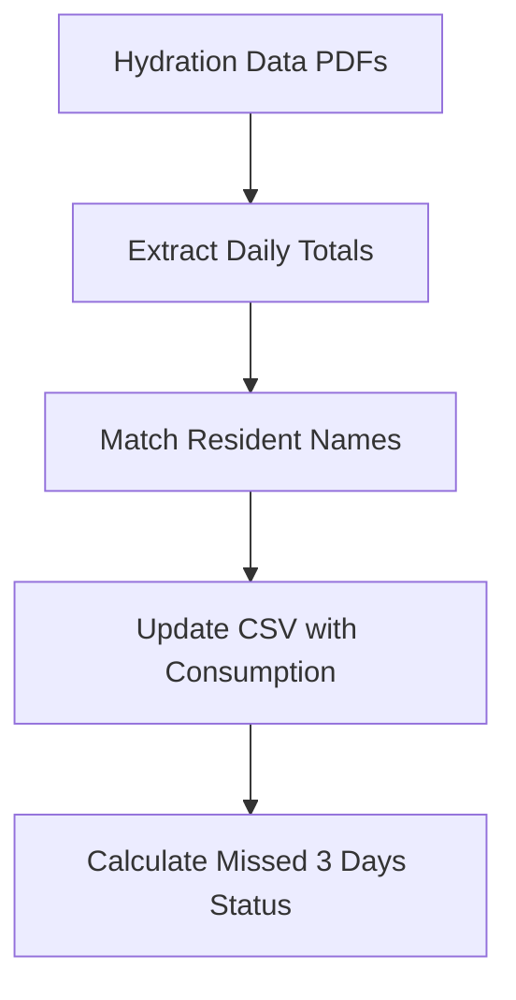
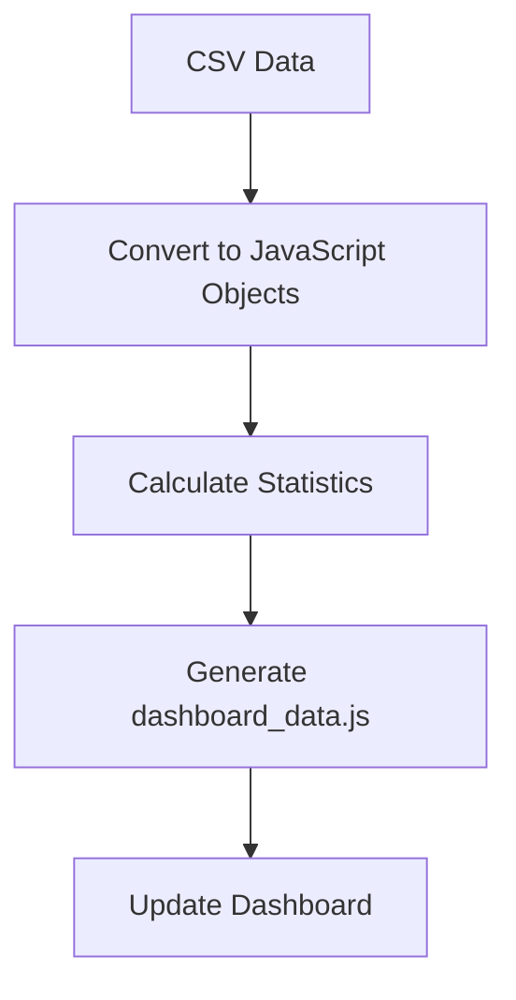

# Hydration Dashboard System

A comprehensive system for processing care plan PDFs and hydration data to generate a dashboard showing resident hydration goals and daily consumption.

## System Overview

This system consists of three main components that work together to process PDF data and generate a hydration dashboard:



## Files Description

### 1. `careplan.py` - Care Plan Processor

**Purpose**: Extracts resident names and hydration goals from care plan PDFs.

**Input**: PDF files in `care-plans/` directory
**Output**: `hydration_goals.csv` with resident names and mL goals

**Key Features**:
- Extracts resident names using flexible regex patterns (handles 4+ digit ID numbers)
- Finds hydration targets from "FLUID TARGET" sections
- Processes multiple PDF pages and associates names with goals
- Handles various name formats and ID number lengths

**Usage**:
```bash
python3 careplan.py
```

**Output Format**:
```csv
Resident Name,mL Goal,Source File
"Boere, Mary Antonia",1700,2.pdf - Page 83
"Smith, John",1500,1.pdf - Page 5
```

### 2. `process_dat_pdf.py` - Hydration Data Processor

**Purpose**: Processes daily hydration consumption data from hydration-data PDFs and updates the CSV.

**Input**: PDF files in `hydration-data/` directory
**Output**: Updates `hydration_goals.csv` with daily consumption data

**Key Features**:
- Extracts daily totals (Day 14, 15, 16) from PDFs
- Matches residents using fuzzy name matching
- Handles "Extra" hydration files (adds to existing values)
- Calculates "Missed 3 Days" status
- Preserves existing goal data from care plans

**Usage**:
```bash
python3 process_dat_pdf.py
```

**Data Flow**:


### 3. `generate_dashboard_data.py` - Dashboard Data Generator

**Purpose**: Converts CSV data to JavaScript format for the dashboard.

**Input**: `hydration_goals.csv`
**Output**: `dashboard_data.js`

**Key Features**:
- Converts CSV data to JavaScript objects
- Calculates statistics (goal met percentage, missed days)
- Generates timestamped data file
- Provides summary statistics

**Usage**:
```bash
python3 generate_dashboard_data.py
```

## Complete Workflow



## Directory Structure

```
hydration/
├── care-plans/              # Care plan PDFs (names & goals)
│   ├── 1.pdf
│   ├── 2.pdf
│   └── 3.pdf
├── hydration-data/          # Daily consumption PDFs
│   ├── CG.pdf
│   ├── HH.pdf
│   └── MG.pdf
├── careplan.py              # Extract names & goals
├── process_dat_pdf.py       # Process consumption data
├── generate_dashboard_data.py # Generate JS data
├── hydration_goals.csv     # Master data file
├── dashboard_data.js       # JavaScript data
└── hydration.html          # Dashboard interface
```

## Data Processing Pipeline

### Step 1: Extract Resident Information


### Step 2: Process Daily Consumption


### Step 3: Generate Dashboard Data


## Key Features

### Name Matching Algorithm
The system uses sophisticated name matching to handle:
- Different name formats (LAST, FIRST vs FIRST LAST)
- Prefixes (DE, VAN, VON, etc.)
- Compound surnames
- Fuzzy matching for slight variations

### Data Integrity
- Preserves existing goal data when processing consumption
- Handles "Extra" hydration files by adding to existing values
- Calculates "Missed 3 Days" based on final values
- Maintains data consistency across all processing steps

### Error Handling
- Graceful handling of missing data
- Validation of numeric values
- Fallback patterns for name extraction
- Comprehensive logging of processing steps

## Usage Instructions

1. **Initial Setup**: Place care plan PDFs in `care-plans/` directory
2. **Extract Goals**: Run `python3 careplan.py` to extract resident names and hydration goals
3. **Add Consumption Data**: Place hydration data PDFs in `hydration-data/` directory
4. **Process Consumption**: Run `python3 process_dat_pdf.py` to add daily consumption data
5. **Generate Dashboard**: Run `python3 generate_dashboard_data.py` to create JavaScript data
6. **View Dashboard**: Open `hydration.html` in a web browser

## Dependencies

- Python 3.6+
- PyPDF2 (for PDF processing)
- pdfminer.six (alternative PDF processing)
- Standard library modules: csv, re, os, json

## Output Files

- `hydration_goals.csv`: Master data file with all resident information
- `dashboard_data.js`: JavaScript data file for dashboard
- `hydration.html`: Interactive dashboard interface

## Statistics Generated

The system automatically calculates:
- Total number of residents
- Goal met percentage
- Number of residents who missed 3 consecutive days
- Daily consumption averages
- Individual resident progress tracking
